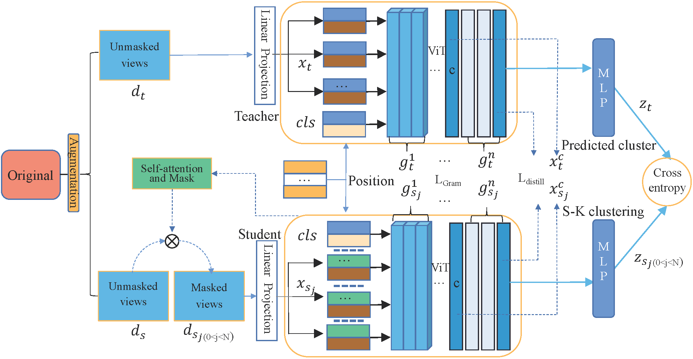
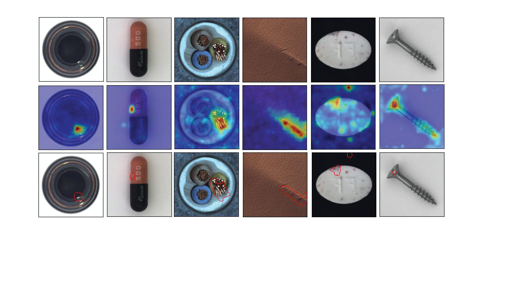

# FEATURE-CONSTRAINED AND ATTENTION-CONDITIONED DISTILLATION LEARNING FOR VISUAL ANOMALY DETECTION
*Authors - Shuo Zhang, Jing Liu∗

**Abstract**- *Visual anomaly detection in computer vision is an essential one-class classification and segmentation problem. The student-teacher (S-T) approach has proven effective in addressing this challenge. However, previous studies based on S-T underutilize the feature representations learned by the teacher network, which restricts anomaly detection performance. In this study, we propose a novel feature-constrained and attention-conditioned distillation learning method for visual anomaly detection with localization, which fully uses the features of the teacher model and the local semantics of the critical structure to instruct the student model to detect anomalies efficiently. Specifically, we introduce the Vision Transformer (ViT) as the backbone for anomaly detection tasks, and the central feature strategy and self-attention masking strategy are proposed to constrain the output features and impose agreement between multi-image views.
It improves the ability of the student network to describe normal data features and widens the feature difference between the student and teacher networks for abnormal data. Experiments on the benchmark datasets demonstrate that the proposed method significantly improves the performance of visual anomaly detection compared with the competing methods.*

# Network
The network is inspired from [Vision Transformer](https://openreview.net/pdf?id=YicbFdNTTy). 
It adapts the trasnformer network for image anomaly detection and localization.

